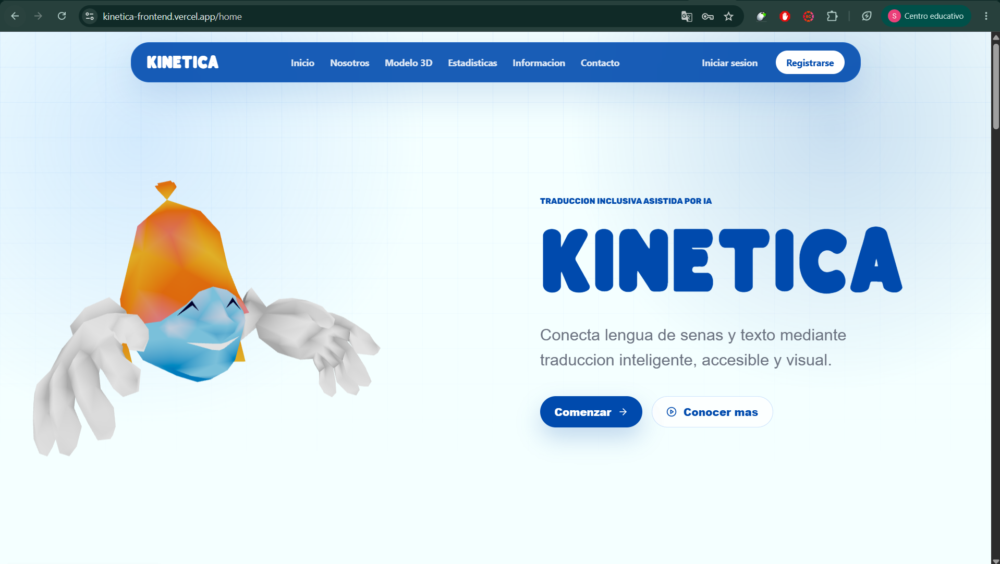

# KINETICA Frontend

Frontend web de KINETICA, una aplicacion de traduccion entre texto y senas con autenticacion, dashboard de usuario, integracion con backend REST, consumo de modelo de prediccion por video y administracion de senas para usuarios con rol `ADMIN`.

## Stack

- React 19
- TypeScript
- Vite
- React Router
- Axios
- Tailwind CSS
- Three.js / React Three Fiber
- React Icons

## Funcionalidades

- Landing publica con informacion del proyecto.
- Login y registro con JWT.
- Login con Google OAuth.
- Persistencia de sesion con `accessToken` y `refreshToken`.
- Interceptor Axios para enviar `Authorization: Bearer`.
- Refresh automatico de token con `/auth/refresh`.
- Dashboard protegido para usuarios autenticados.
- Perfil de usuario con datos obtenidos desde `/auth/me`.
- Edicion de username con `/users/me`.
- Cambio de contrasena con `/auth/change-password`.
- Traduccion de texto a senas usando `/translations`.
- Traduccion de sena a texto usando modelo externo y backend.
- Visualizacion de animaciones de senas en modelo 3D.
- Carga de senas desde `/signs`.
- Modulo ADMIN para administrar senas:
  - Listar senas.
  - Crear senas.
  - Editar senas.
  - Eliminar senas.
  - Acceso visible solo para usuarios con `role === "ADMIN"`.
  - Ruta protegida contra usuarios no autorizados.

## Requisitos

- Node.js 20 o superior recomendado.
- Backend de KINETICA ejecutandose.
- Servicio del modelo de prediccion disponible si se usara la traduccion por video.

## Instalacion

```bash
npm install
```

## Variables de entorno

Crea un archivo `.env` basado en `.env.example`.

```env
VITE_API_URL=http://localhost:8080/api/v1
VITE_MODEL_API_URL=http://127.0.0.1:8000/predict_video
VITE_GOOGLE_OAUTH_URL=http://localhost:8080/oauth2/authorization/google
```

En produccion, por ejemplo Vercel, estas variables deben configurarse en el panel del proyecto. Al usar Vite, las variables expuestas al frontend deben iniciar con `VITE_`.

## Scripts

```bash
npm run dev
```

Levanta el servidor de desarrollo.

```bash
npm run build
```

Compila TypeScript y genera el build de produccion.

```bash
npm run preview
```

Sirve localmente el build generado.

```bash
npm run lint
```

Ejecuta ESLint sobre el proyecto.

## Rutas principales

### Publicas

- `/home`
- `/home/about-us`
- `/home/help`
- `/auth/login`
- `/auth/register`
- `/auth/callback`
- `/auth/error`

### Dashboard autenticado

- `/dashboard`
- `/dashboard/sing-to-text`
- `/dashboard/text-to-sing`
- `/dashboard/perfil`

### Dashboard ADMIN

- `/dashboard/signs-admin`

Esta ruta solo es accesible para usuarios cuyo rol obtenido desde `/auth/me` sea `ADMIN`.

## Endpoints usados

### Autenticacion

- `POST /auth/login`
- `POST /auth/register`
- `GET /auth/me`
- `POST /auth/logout`
- `POST /auth/refresh`
- `PATCH /auth/change-password`

### Usuario

- `PATCH /users/me`

### Senas

- `GET /signs`
- `GET /signs/{id}`
- `POST /signs`
- `PUT /signs/{id}`
- `PATCH /signs/{id}`
- `DELETE /signs/{id}`

### Traducciones

- `POST /translations`
- `GET /translations/{requestId}`

### Modelo externo

- `POST VITE_MODEL_API_URL`

El modelo recibe un archivo de video mediante `FormData` con el campo `file`.

## Estructura relevante

```txt
src/
  api/
    axios.ts
  components/
    Siderbar.tsx
    LoginForm.tsx
    RegisterForm.tsx
  context/
    AuthContext.ts
    AuthProvider.tsx
  hooks/
    useAuth.ts
    useSignQueue.ts
    useTranslationFlow.ts
  layouts/
    DashboardLayout.tsx
    MainLayout.tsx
  pages/
    access/
    authGoogle/
    home/
    traductor/
      HomeTraductorPage.tsx
      PerfilPage.tsx
      SignsAdminPage.tsx
      SingToText.tsx
      TextToSing.tsx
  routes/
    AdminRoute.tsx
    AppRoute.tsx
    ProtectedRoute.tsx
  services/
    AuthService.ts
    ModelService.ts
    SignService.ts
    translationService.ts
  types/
```

## Autenticacion y roles

El login devuelve tokens y datos basicos del usuario. Como la respuesta de autenticacion no incluye el rol, el frontend consulta `/auth/me` despues de iniciar sesion y al restaurar una sesion guardada.

El rol queda almacenado en el estado del usuario dentro de `AuthContext`. Con ese dato:

- El Sidebar muestra `Administrar senas` solo a usuarios `ADMIN`.
- `AdminRoute` bloquea `/dashboard/signs-admin` para usuarios no administradores.

## Administracion de senas

El modulo de administracion usa el servicio `SignService`.

Body usado para crear y editar:

```json
{
  "label": "hola",
  "mediaRef": "hola.glb",
  "locale": "es-PE",
  "active": true,
  "animationSrc": "base64-o-url"
}
```

Respuesta esperada:

```json
{
  "id": 1,
  "label": "hola",
  "normalizedLabel": "hola",
  "mediaRef": "hola.glb",
  "locale": "es-PE",
  "active": true,
  "animationSrc": "base64-o-url"
}
```

## Despliegue

Para desplegar en Vercel:

1. Configura las variables `VITE_API_URL`, `VITE_MODEL_API_URL` y `VITE_GOOGLE_OAUTH_URL`.
2. Ejecuta un nuevo deploy despues de modificar variables.
3. Verifica que el backend permita CORS desde el dominio del frontend.
4. Verifica que las URLs de OAuth configuradas en Google y backend coincidan con el dominio de produccion.

## Verificacion local

```bash
npm run build
```

El build debe completar sin errores TypeScript. Pueden aparecer advertencias de tamano de bundle o reglas CSS, pero no bloquean la compilacion.

ENVIDENICA DLE DEPLOY 
